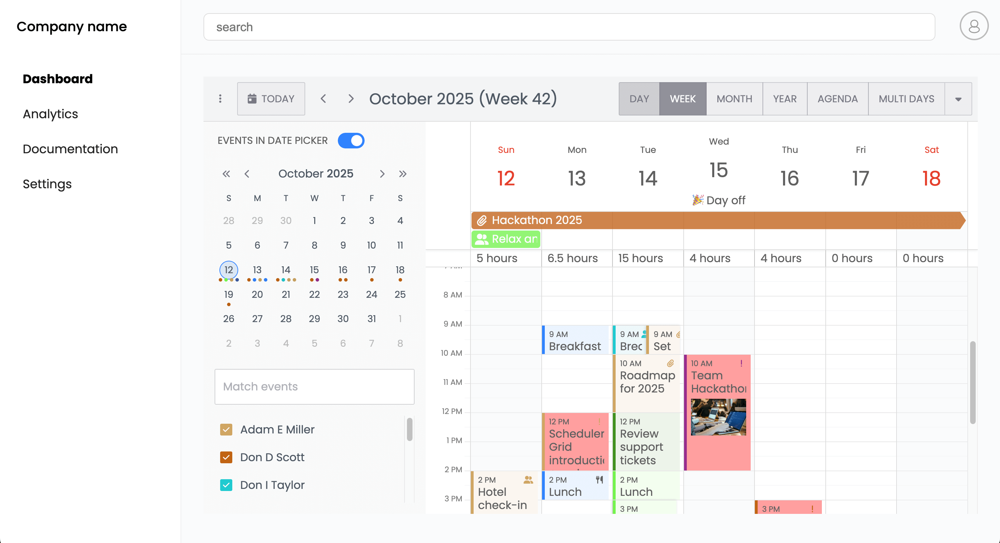

# How to help your customers onboard with Bryntum’s HintFlow: starter code

This starter project was generated using the [Vite with JavaScript](https://vite.dev/guide/#scaffolding-your-first-vite-project) starter template.

## Getting started

Install the dependencies by running the following command: 

```sh
npm install
```

## Installing the Bryntum Calendar component

To install the Bryntum Calendar, first access the private Bryntum npm registry by following the [guide to using the Bryntum npm repository](https://bryntum.com/products/calendar/docs/guide/Calendar/npm-repository#repository-access). Once you’ve logged in to the registry, you can install the Bryntum Calendar component.

If you have a Bryntum Calendar license, install the component with the following command:

```bash
npm install @bryntum/calendar
```

If you are trying out Bryntum Calendar, install the trial version:

```bash
npm install @bryntum/calendar@npm:@bryntum/calendar-trial
```

## Running the app

Use the following command to run the local dev server:

```sh
npm run dev
```

Open `http://localhost:5173`. You'll see an app with a **Dashboard** page that has a Bryntum Calendar::

